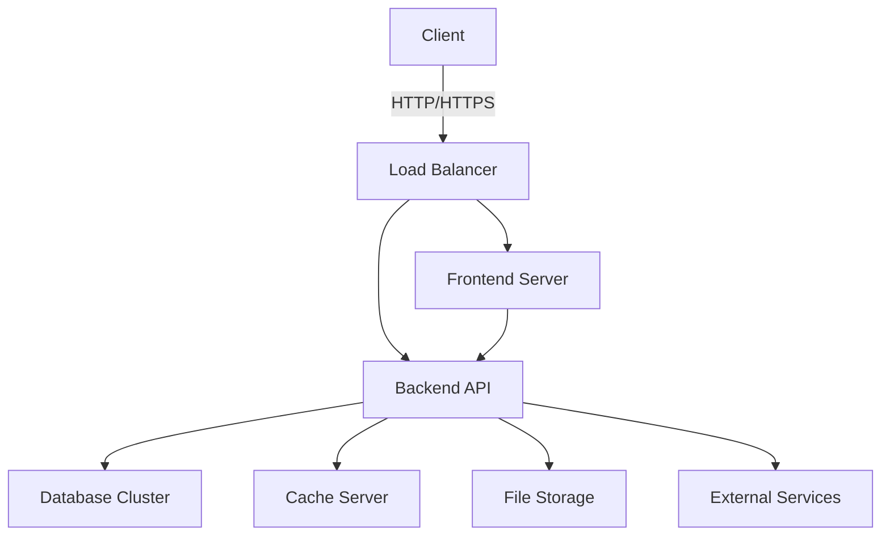

# System Architecture - Project Planner Pro

## Overview

Project Planner Pro follows a modular, microservices-based architecture with clear separation of concerns.

---

## Architecture Diagram



---

## Technology Stack

### Frontend Layer
- Framework: React 18+ with TypeScript
- Styling: Tailwind CSS + Custom CSS Modules
- State Management: Zustand or Redux Toolkit
- Routing: React Router v6
- API Client: React Query + Axios
- UI Components: Custom + Headless UI
- Animations: Framer Motion
- Forms: React Hook Form + Zod

### Backend Layer
- Framework: FastAPI (Python) or NestJS (Node.js)
- Authentication: JWT + OAuth2
- Validation: Pydantic or class-validator
- File Upload: Multer + Cloud Storage
- Real-time: WebSocket (Socket.IO)
- Task Queue: Celery + Redis or BullMQ

### Database Layer
- Primary Database: PostgreSQL 15+
- ORM: SQLAlchemy or TypeORM
- Migration: Alembic or TypeORM CLI
- Cache: Redis 7+
- Search: Elasticsearch or PostgreSQL Full-Text

### Infrastructure
- Containerization: Docker + Docker Compose
- Orchestration: Kubernetes
- Reverse Proxy: Nginx or Traefik
- Load Balancing: Nginx or HAProxy
- Monitoring: Prometheus + Grafana
- Logging: ELK Stack

---

## Directory Structure

```
src/
├── frontend/
│   ├── public/
│   │   ├── index.html
│   │   └── assets/
│   ├── src/
│   │   ├── api/
│   │   │   ├── client.ts
│   │   │   └── endpoints.ts
│   │   ├── components/
│   │   │   ├── common/
│   │   │   └── domain/
│   │   ├── pages/
│   │   ├── hooks/
│   │   ├── store/
│   │   ├── types/
│   │   ├── utils/
│   │   └── App.tsx
│   └── package.json
└── backend/
    ├── app/
    │   ├── controllers/
    │   ├── models/
    │   ├── routes/
    │   └── main.py
    └── requirements.txt
```

---

## Authentication & Authorization

### Authentication Flow
1. User submits credentials
2. Server validates credentials
3. Generates JWT token with claims
4. Returns token to client
5. Client stores token in secure HttpOnly cookie
6. Subsequent requests include token in Authorization header

### JWT Token Structure
```json
{
  "sub": "user_id",
  "name": "user_name",
  "email": "user_email",
  "roles": ["user", "admin"],
  "iat": 1234567890,
  "exp": 1234567890
}
```

### RBAC Roles
| Role | Permissions |
|------|-------------|
| Guest | View public projects |
| Viewer | View all projects, read-only |
| Developer | Create/Edit issues, view code |
| Project Manager | Manage projects, sprints |
| Admin | Manage users, settings |
| Owner | Full access |

---

## Database Schema

### Core Tables

#### Users
```sql
CREATE TABLE users (
    id SERIAL PRIMARY KEY,
    username VARCHAR(50) UNIQUE NOT NULL,
    email VARCHAR(255) UNIQUE NOT NULL,
    password_hash VARCHAR(255) NOT NULL,
    full_name VARCHAR(100),
    role VARCHAR(20) DEFAULT 'developer',
    is_active BOOLEAN DEFAULT true,
    created_at TIMESTAMP DEFAULT NOW()
);
```

#### Projects
```sql
CREATE TABLE projects (
    id SERIAL PRIMARY KEY,
    name VARCHAR(100) NOT NULL,
    description TEXT,
    key VARCHAR(10) UNIQUE NOT NULL,
    status VARCHAR(20) DEFAULT 'active',
    created_by INTEGER REFERENCES users(id),
    created_at TIMESTAMP DEFAULT NOW()
);
```

#### Sprints
```sql
CREATE TABLE sprints (
    id SERIAL PRIMARY KEY,
    name VARCHAR(100) NOT NULL,
    goal TEXT,
    status VARCHAR(20) DEFAULT 'planned',
    start_date DATE NOT NULL,
    end_date DATE NOT NULL,
    project_id INTEGER REFERENCES projects(id),
    created_at TIMESTAMP DEFAULT NOW()
);
```

#### Issues
```sql
CREATE TABLE issues (
    id SERIAL PRIMARY KEY,
    number INTEGER NOT NULL,
    title VARCHAR(255) NOT NULL,
    description TEXT,
    type VARCHAR(20) DEFAULT 'task',
    status VARCHAR(20) DEFAULT 'backlog',
    priority VARCHAR(20) DEFAULT 'medium',
    story_points INTEGER,
    project_id INTEGER REFERENCES projects(id),
    sprint_id INTEGER REFERENCES sprints(id),
    created_by INTEGER REFERENCES users(id),
    assigned_to INTEGER REFERENCES users(id),
    created_at TIMESTAMP DEFAULT NOW()
);
```

---

## API Design

### RESTful Endpoints

#### Authentication
- POST /api/auth/login
- POST /api/auth/register
- GET /api/auth/me

#### Projects
- GET /api/projects
- POST /api/projects
- GET /api/projects/{id}

#### Sprints
- GET /api/projects/{projectId}/sprints
- POST /api/projects/{projectId}/sprints

#### Issues
- GET /api/projects/{projectId}/issues
- POST /api/projects/{projectId}/issues
- PUT /api/issues/{id}/status

---

## Security Considerations

- All sensitive data encrypted at rest
- HTTPS enforced for all communications
- JWT tokens with short expiration
- Rate limiting on API endpoints
- Input validation and sanitization
- CSRF protection
- Audit logging

---

**Architecture designed by Abdulraheem Nohari**